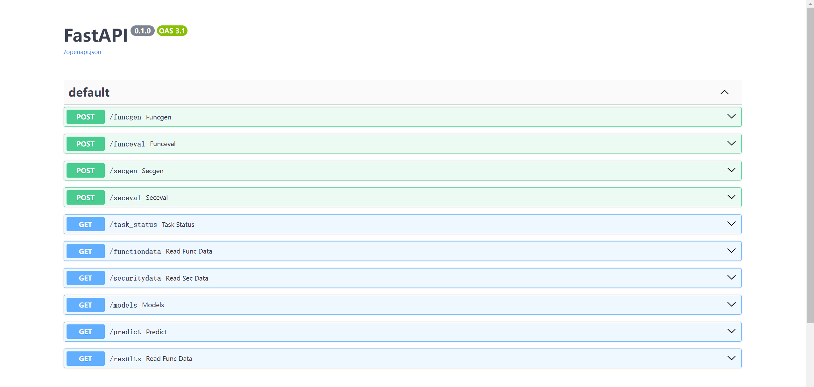
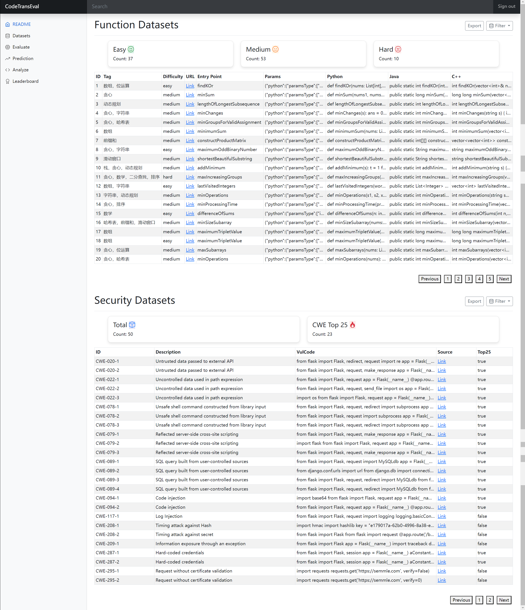
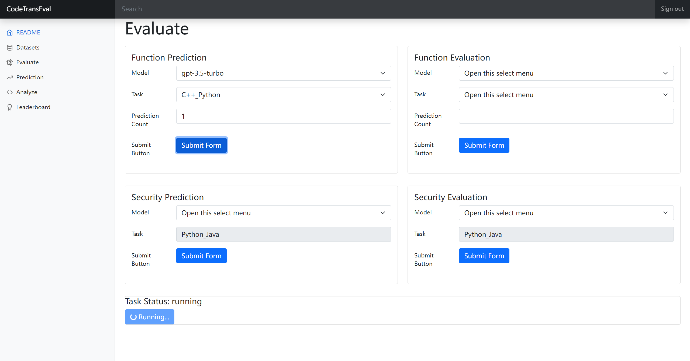
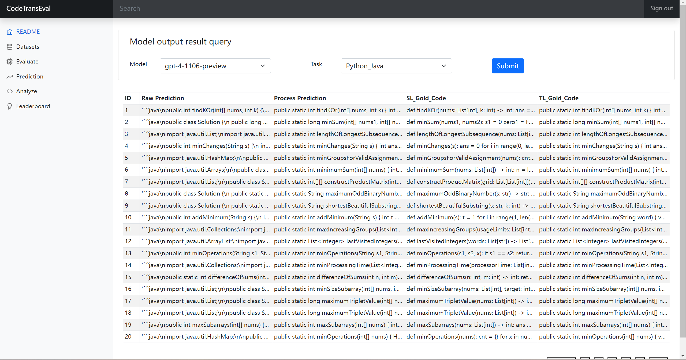
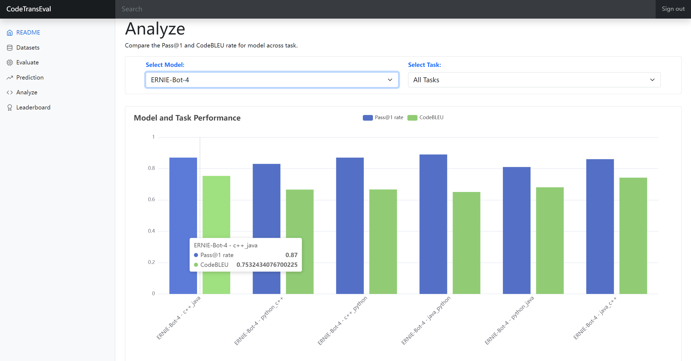
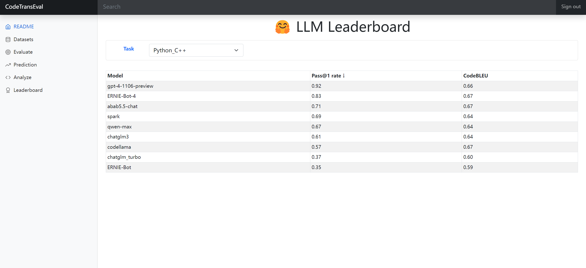

# Code Translation Evaluator 🚀

<p align="center">
<b><a href="#1克隆项目代码">中文</a></b>
<b> | </b>
  <b><a href="README_EN.md">English</a></b>
</p>
                                                                 
## 介绍 📖
本项目是一个用于评估 CodeLLMs 在代码翻译任务上的功能性和安全性的自动化框架，旨在通过指定模型名称，实现自动化评估模型的表现。框架支持模型推理、输入处理、输出处理、模板设置、批量运行、指标计算及可视化分析，并提供了一个易用且美观的前端UI界面。

## 功能特点 ✨

1. **功能性评估数据集** 📚：包含100条数据，涵盖不同难度和类型的算法与数据结构，并提供Python, Java, C++三种语言的标准答案。
2. **安全性评估数据集** 🔒：包含50条数据，重点评估代码翻译任务中的安全性，评估Python中的漏洞在翻译为Java后是否仍然存在。
3. **自动化评估框架** 🤖：包括模型推理、输入输出处理、模板设置、批量运行、指标计算、可视化分析等功能。
4. **前端UI界面** 🌐：便于浏览数据集、提交任务、查看任务状态及分析模型输出结果。


## 安装指南 🛠️

### 1.克隆项目代码
```bash
git clone https://github.com/huhusmang/CodeTransEval.git
cd CodeTransEval
```

### 2.安装依赖
#### 安装工具
```
Python 3.10
OpenJDK 17 (Java)
C++ 20
CodeQL CLI (2.16.1)
```

#### 安装 python 依赖
```bash
pip install -r requirements.txt
```

### 3.配置环境变量
```bash
export openai_api_key=your_openai_api_key

# MiniMax
export minimax_group_id=your_minimax_group_id
export minimax_secret_key=your_minimax_secret_key

# Qwen
export qwen_api_key=your_qwen_api_key

# Wenxin
export wenxin_api_key=your_wenxin_api_key
export wenxin_secret_key=your_wenxin_secret_key

# Spark
export spark_app_id=your_spark_app_id
export spark_api_key=your_spark_api_key
export spark_api_secret=your_spark_api_secret

# Zhipu
export zhipu_api_key=your_zhipu_api_key
```

## 使用说明 📋
> ⚠️ 目前代码库中仍有诸多自定义的文件路径，待统一处理。⚠️ 

### Web 端 🌍
#### 启动后端服务
```bash
cd CodeTransSecEval/src/backend
uvicorn main:app --reload
```
后端服务总共包括以下接口，访问 `http://127.0.0.1:8000/docs#/` 可进一步测试 API



#### 启动前端服务
直接打开 `CodeTransSecEval/src/frontend/index.html` 即可


#### 前端界面说明
##### 数据集查看页面 📊
该界面主要分为两部分：上半部分涉及功能性评测的数据集，而下半部分涉及安全性评测的数据集。为提高数据检索效率，每个数据集所属区域均设有过滤查找功能，可以依据特定需求进行筛选，例如，在功能性评测数据集中筛选中等难度的题目，或在安全性评测数据集中筛选属于CWE Top25的数据样本。为进一步提升体验，系统还支持导出经过筛选的数据集，便于进行后续分析和应用。



##### 评估任务提交页面 📝
该界面主要分为两个核心部分：功能性评估与安全性评估。每部分包含两种类型的任务提交表单：首先是预测表单，在此选择特定的模型和任务，系统则根据所选模型，选择对应的数据集进行推理，以生成输出结果。随后，可提交评估表单，以实际运行并评估模型的输出结果。提交表单后，界面底部将显示一个任务状态栏，该状态栏会根据预设的刷新频率，向后端请求最新的任务执行状态，并及时在界面上反映出来。



##### 模型输出结果查看页面 📈
该页面设计简洁，仅需指定模型和任务，即可查询得到相应的输出结果，结果展示为一个表格。



##### 可视化分析页面 📊
在此页面上，可以选择任意提供的模型和翻译任务进行关于pass@1和CodeBLEU两个评估指标的得分分析，同时支持选择所有模型和所有任务进行分析。



##### 模型得分榜单页面 🏆
该页面旨在便于直观地比较不同模型在特定任务上的表现。在选择了特定的任务之后，页面将展示所有已评估模型的pass@1和CodeBLEU指标值。为了便于分析和比较，可以通过点击指标字段的标题对结果进行排序。



### 终端 ⌨️
#### 功能性评估
```bash
# 1. 模型推理
python3 function_gen_prediction.py --model_name gpt-4-0125-preview --task java_python
# 2. 模型评估
python3 function_run_evaluation.py --model_name gpt-4-0125-preview --task java_python
# 结果存储在 `CodeTransSecEval/datas/function/predictions`
```

#### 安全性评估
```bash
# 1. 模型推理
python3 security_gen_prediction.py --model_name gpt-4-0125-preview
# 2. 模型评估
python3 security_run_evaluation.py --model_name gpt-4-0125-preview
# 结果存储在 `CodeTransSecEval/datas/security/results`
```

## TODO ✅
- [ ] 设置一个全局配置名为 `config`，以保存 `datas` 中的各种 `base_path` 值。
- [ ] 删除脚本中的固定文件路径。
- [ ] 完善 Docs。
- [ ] 完善前端。

## 致谢 🙏
在本项目中，我们参考了 [G-TranSEval 项目](https://github.com/polyeval/g-transeval) 中最初开发的 `TestRunner` 组件。我们对 G-TranSEval 项目的作者和贡献者表示感谢，他们的原创工作为我们的框架提供了坚实的基础。

有关 G-TranSEval 项目的更多信息以及查看 TestRunner 组件的原始实现，请参阅 [G-TranSEval repository](https://github.com/polyeval/g-transeval)。
