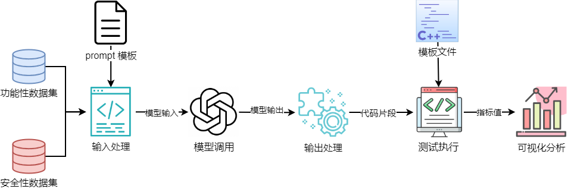
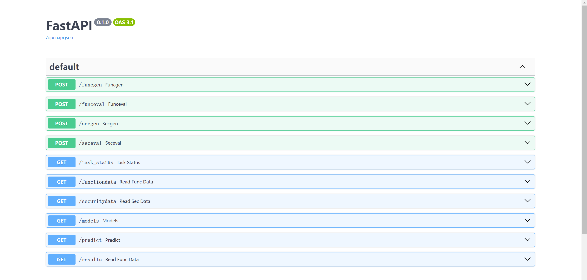
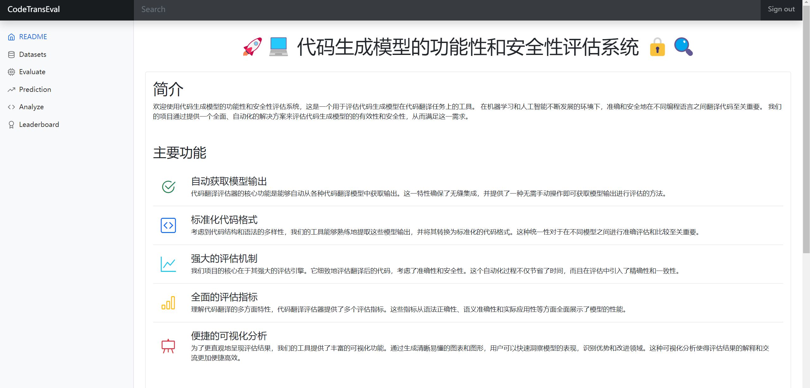
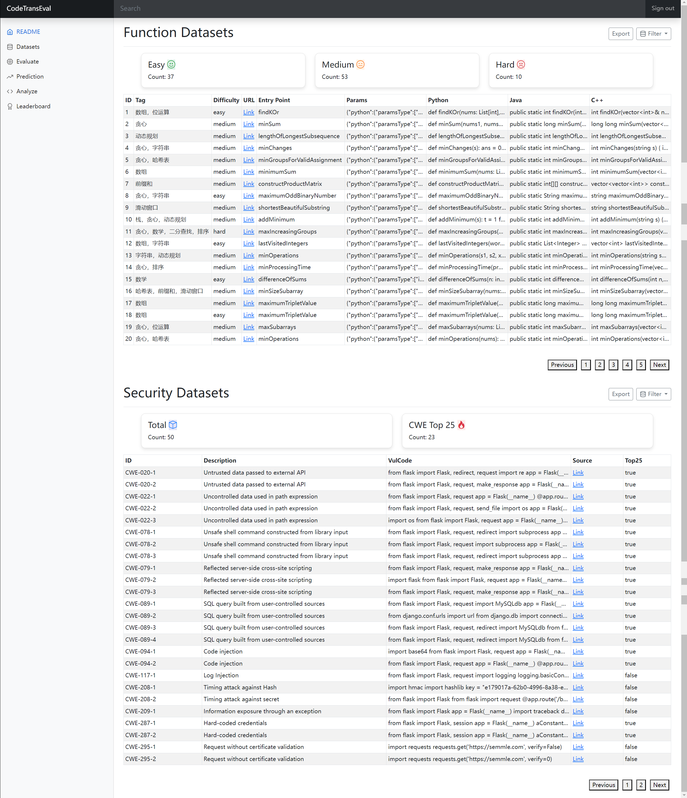
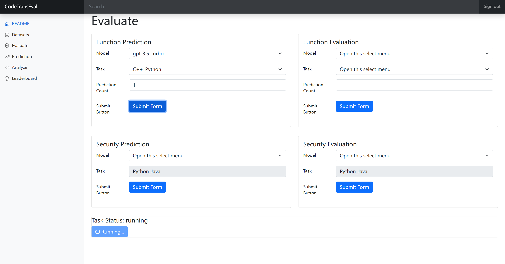
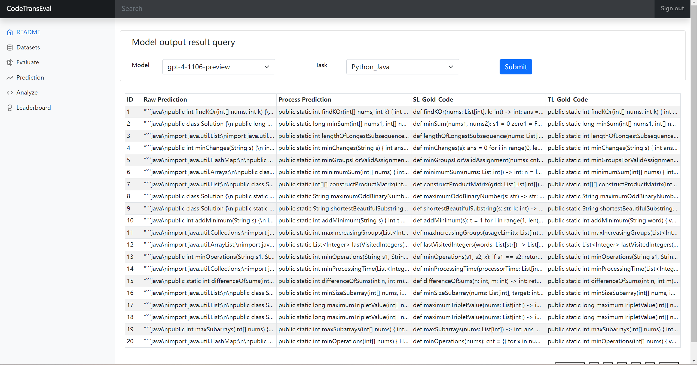
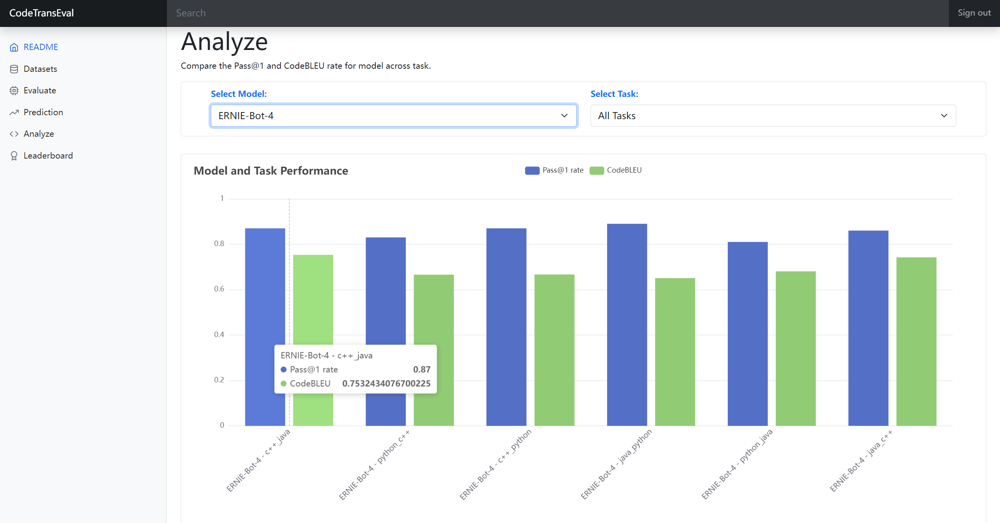
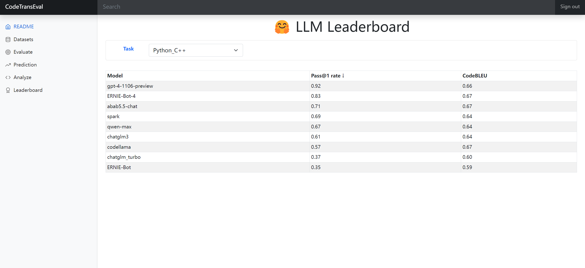

# Code Translation Evaluator 🚀

## Introduction 📖
This project is an automated framework for evaluating the functionality and security of CodeLLMs in code translation tasks. It aims to automatically assess model performance by specifying the model name. The framework supports model inference, input processing, output processing, template setting, batch execution, metric calculation, and visualization analysis, and provides an easy-to-use and visually appealing front-end UI.

## Features ✨

1. **Functionality Evaluation Dataset** 📚: Contains 100 data items, covering various difficulty levels and types of algorithms and data structures, with standard answers in Python, Java, and C++.
2. **Security Evaluation Dataset** 🔒: Contains 50 data items, focusing on evaluating the security of code translation tasks and assessing whether vulnerabilities in Python still exist when translated to Java.
3. **Automated Evaluation Framework** 🤖: Includes model inference, input and output processing, template setting, batch execution, metric calculation, and visualization analysis.
4. **Front-end UI** 🌐: Facilitates browsing datasets, submitting tasks, checking task status, and analyzing model output results.


## Installation Guide 🛠️

### 1. Clone the project
```bash
git clone https://github.com/huhusmang/CodeTransEval.git
cd CodeTransEval
```

### 2. Install dependencies
#### Install tools
```
Python 3.10
OpenJDK 17 (Java)
C++ 20
CodeQL CLI (2.16.1)
```

#### Install python dependencies
```bash
pip install -r requirements.txt
```

### 3. Configure environment variables
```bash
export openai_api_key=your_openai_api_key

# MiniMax
export minimax_group_id=your_minimax_group_id
export minimax_secret_key=your_minimax_secret_key

# Qwen
export qwen_api_key=your_qwen_api_key

# Wenxin
export wenxin_api_key=your_wenxin_api_key
export wenxin_secret_key=your_wenxin_secret_key

# Spark
export spark_app_id=your_spark_app_id
export spark_api_key=your_spark_api_key
export spark_api_secret=your_spark_api_secret

# Zhipu
export zhipu_api_key=your_zhipu_api_key
```

## Usage Instructions 📋
> ⚠️ There are still many custom file paths in the codebase that need to be standardized. ⚠️ 

### Web 🌍
#### Start backend service
```bash
cd CodeTransSecEval/src/backend
uvicorn main:app --reload
```
The backend service includes the following interfaces. Visit `http://127.0.0.1:8000/docs#/` for further API testing.



#### Start frontend service
Simply open `CodeTransSecEval/src/frontend/index.html`



#### Front-end Interface Instructions
##### Dataset Viewing Page 📊
This interface is mainly divided into two parts: the upper part involves the functionality evaluation dataset, and the lower part involves the security evaluation dataset. To improve data retrieval efficiency, each dataset area has a filtering function that allows for screening based on specific needs. For example, filter medium difficulty questions in the functionality evaluation dataset or filter samples belonging to CWE Top25 in the security evaluation dataset. To further enhance the experience, the system also supports exporting filtered datasets for subsequent analysis and application.



##### Evaluation Task Submission Page 📝
This interface is mainly divided into two core parts: functionality evaluation and security evaluation. Each part contains two types of task submission forms: First, the prediction form, where you select a specific model and task, and the system selects the corresponding dataset for inference to generate output results based on the chosen model. Then, you can submit the evaluation form to actually run and evaluate the model's output results. After submitting the form, a task status bar will appear at the bottom of the interface, which will request the latest task execution status from the backend at a preset refresh rate and promptly reflect it on the interface.



##### Model Output Results Viewing Page 📈
This page is simply designed; you only need to specify the model and task to query the corresponding output results, which are displayed in a table.



##### Visualization Analysis Page 📊
On this page, you can select any provided model and translation task for score analysis on pass@1 and CodeBLEU evaluation metrics. It also supports selecting all models and all tasks for analysis.



##### Model Leaderboard Page 🏆
This page aims to facilitate a visual comparison of different models' performance on specific tasks. After selecting a specific task, the page will display pass@1 and CodeBLEU metrics for all evaluated models. For easier analysis and comparison, you can sort the results by clicking on the metric field titles.



### Terminal ⌨️
#### Functionality Evaluation
```bash
# 1. Model inference
python3 function_gen_prediction.py --model_name gpt-4-0125-preview --task java_python
# 2. Model evaluation
python3 function_run_evaluation.py --model_name gpt-4-0125-preview --task java_python
# Results are stored in `CodeTransSecEval/datas/function/predictions`
```

#### Security Evaluation
```bash
# 1. Model inference
python3 security_gen_prediction.py --model_name gpt-4-0125-preview
# 2. Model evaluation
python3 security_run_evaluation.py --model_name gpt-4-0125-preview
# Results are stored in `CodeTransSecEval/datas/security/results`
```

## TODO ✅
- [ ] Set a global configuration named `config` to save various `base_path` values in `datas`.
- [ ] Remove hard-coded file paths in scripts.
- [ ] Improve Docs.
- [ ] Improve the front-end.

## Acknowledgements 🙏
In this project, we referred to the `TestRunner` component initially developed in the [G-TranSEval project](https://github.com/polyeval/g-transeval). We thank the authors and contributors of the G-TranSEval project for their original work, which provided a solid foundation for our framework.

For more information about the G-TranSEval project and to view the original implementation of the TestRunner component, please refer to the [G-TranSEval repository](https://github.com/polyeval/g-transeval).